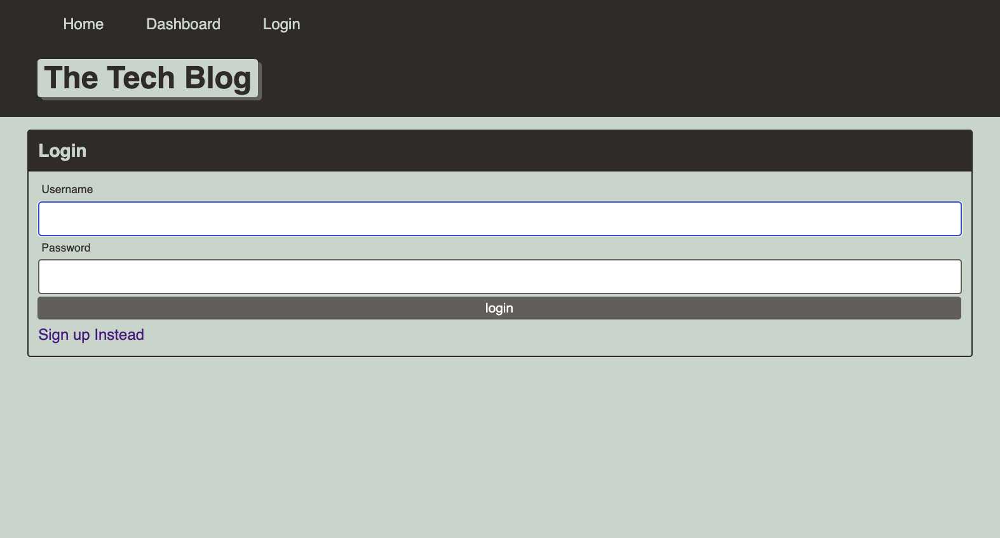
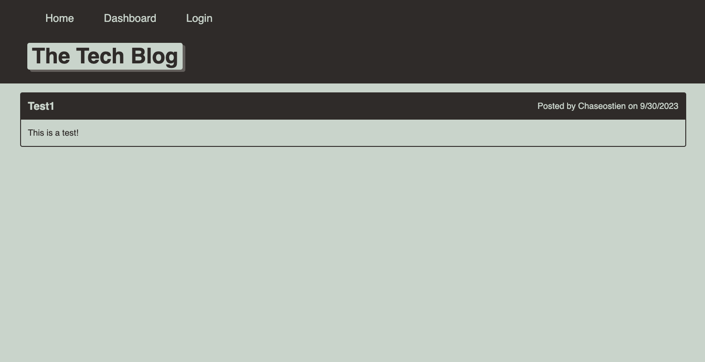

# Tech Blog 

<p align="center">
    
    
    
    
    
    
    
    
    
    
    
</p>

## Description
This project was designed to test our full stack skills by building a CMS-style Tech-Blog similar to a WordPress site from scratch. This project utilizes the MVC paradigm as an architectural structure, Handlebars.js as a templating language, Sequelize as the ORM and express-session npm package for authentication. 


## Table of Contents

- [Installation](#installation)
- [Usage](#usage)
- [Example](#example)
- [Contributors](#contributors)
- [Deploy](#deploy)
- [License](#license)
- [Questions](#questions)

## Installation

```
npm install
npm start
```

## Usage
This Tech Blog application is designed to perform all CRUD operations. Navigating the site will allow you to login or sign up, view and read existing posts and comments, create new posts/comments and edit/delete existing posts. You will be able to view existing posts when you load the application, however, you will need to sign up or login if you wish to create, edit or delete posts, along viewing and leaving comments.


## Example




## Contributors

* [Chase Ostien](https://github.com/ChaseOstien)

## Deploy

Website: https://tech-blog-12-2c4e0baa09b6.herokuapp.com/

## License

ISC License

https://opensource.org/licenses/ISC

## Questions

For additional questions, contact me at the email provided below.

- GitHub: [Tech Blog](https://github.com/ChaseOstien/Tech_Blog)
- Heroku: [tech-blog-12](https://tech-blog-12-2c4e0baa09b6.herokuapp.com/)
- Chaseostien@gmail.com